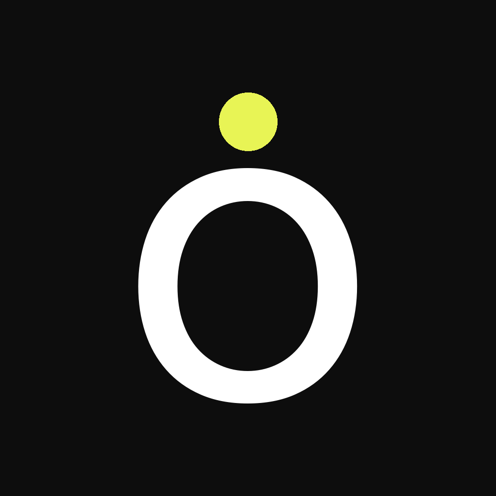

# Offbeat

A local multiplayer party game for 3–10 players, one phone. Music-based social deduction — everyone gets a secret theme except the Impostor, who has to blend in.



## How it plays

1. **Setup** — add 3–10 player names.
2. **Role reveal** — pass the phone around. Everyone except one player sees the same hidden theme (e.g. *"Songs that feel like summer"*). The Impostor sees only that they're the Impostor.
3. **Play order** — the app shows a randomised order. Each player plays a song out loud from any music app of their choice.
4. **Reveal** — the group discusses, then taps to reveal who the Impostor was.
   - **Group wins** if they correctly guess the Impostor.
   - **Impostor wins** if they fool the group.

## Stack

- Swift + SwiftUI (iOS 16+)
- MVVM with a single `GameViewModel`
- No backend, no accounts, no persistence, no third-party SDKs — fully local and stateless per session
- iPhone only, portrait

## Project structure

```
Offbeat/
├── App/                 # App entry + NavigationStack routing
├── Models/              # Player, GameSession
├── ViewModels/          # GameViewModel
├── Views/               # Home, PlayerSetup, RoleReveal, PlayOrder, Reveal, HowToPlay
├── Components/          # PrimaryButton, PlayerChip, ProgressDots
├── Resources/           # DesignSystem tokens, Themes pool
└── Assets.xcassets/
```

## Running locally

1. Clone the repo
2. Open `Offbeat.xcodeproj` in Xcode 16+
3. Select an iPhone simulator (or your device)
4. ⌘R

## Design

Design tokens live in [`Offbeat/Resources/DesignSystem.swift`](Offbeat/Resources/DesignSystem.swift):

| Token   | Hex       |
| ------- | --------- |
| bg      | `#0D0D0D` |
| surface | `#1A1A1A` |
| border  | `#2A2A2A` |
| accent  | `#E8F455` |
| text    | `#FFFFFF` |
| muted   | `#888888` |

Player identity palette: coral, sky, mint, lavender, pink, amber — each at matched chroma/lightness so they cohabit with the accent.

## Themes

44 hard-coded themes in [`Offbeat/Resources/Themes.swift`](Offbeat/Resources/Themes.swift). Selected without repeats within a session; the pool reshuffles once exhausted.
